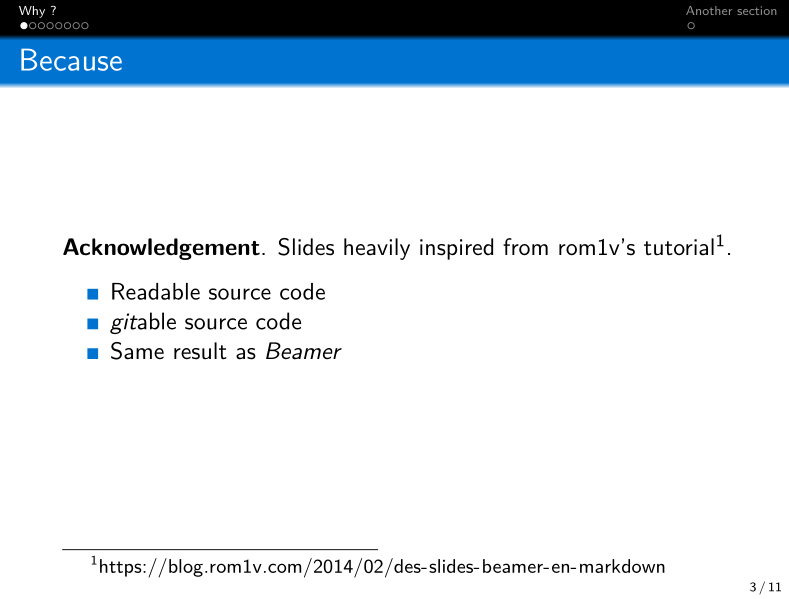

# estonia-beamer-theme

Yet another [Beamer](https://en.wikipedia.org/wiki/Beamer_(LaTeX)) theme.

- Inspired by Frankfurt default theme.
- Colors inspired from the [flag of Estonia](https://en.wikipedia.org/wiki/Flag_of_Estonia).
- Should be colorblind-proof (that's why `exampleblock` is not green).

## Usage

- Copy [beamerthemeEstonia.sty](./beamerthemeEstonia.sty) in your project directory — or into any other path found by your LaTeX compiler.
- Like other themes, put `\usetheme{Estonia}` in your document preamble.
- (Hack it at will.)

## Example

- Example slides in [example.md](./example.md) (using [Pandoc](https://en.wikipedia.org/wiki/Pandoc)'s markdown).
- Rendered in [example.pdf](./example.pdf).
- Generate them via `nix-build` — or by installing pandoc and a LaTeX suite and via `pandoc -st beamer example.md -o example.pdf`.

